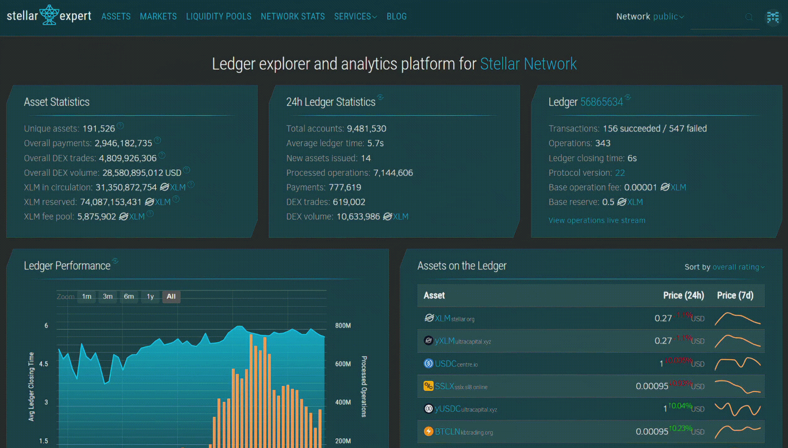

# Travel Safety App 🆘

A blockchain-based safety reporting system for travelers

---

## Contract Deployment

### Contract Address:  `GB2EDODPMGLJOHG46X5JIVIVY7CB4UHDMH3W5BT6TZY37S32Q7KDCQWY`


---
| Transaction Screenshot |
| :---------------------: |
|  |
---

---

## Table of Contents

- [Project Structure](#project-structure)
- [Project Description](#project-description)
- [Project Vision](#project-vision)
- [Key Features](#key-features)
  - [Smart Contract Capabilities](#smart-contract-capabilities)
  - [Technical Implementation](#technical-implementation)
- [Future Scope](#future-scope)
  - [Short-term Developments](#short-term-developments)
  - [Medium-term Expansions](#medium-term-expansions)
  - [Long-term Vision](#long-term-vision)

  ---

## Project Structure 
```
TravelSafetyApp/
├── contracts/
│   └── hello_world/
│       ├── src/
│       │   ├── lib.rs
│       │   └── test.rs
│       └── Cargo.toml
├── Cargo.toml
└── README.md
```
---


## Project Description
The Travel Safety App is a decentralized application built on the Stellar blockchain using Soroban smart contracts. It enables travelers to report safety concerns, hazards, or incidents in various locations, creating a global, tamper-proof safety database for the travel community.

This smart contract solution allows travelers to:
- Report safety issues in specific locations
- Assign severity ratings to safety concerns
- Verify safety reports for authenticity
- Track resolution of safety issues over time
- Access a transparent history of safety information in travel destinations

The application combines the transparency and immutability of blockchain technology with the practical need for reliable safety information while traveling.

---


## Project Vision
Our vision is to create a global, community-driven safety network for travelers that helps people make informed decisions about their destinations. By leveraging blockchain technology, we ensure that safety information remains tamper-proof, accessible, and transparent. 

The Travel Safety App aims to:
- Empower travelers with reliable safety information
- Create a global community of safety-conscious travelers
- Provide local authorities with validated safety concerns that need addressing
- Reduce travel-related incidents through increased awareness
- Bridge the information gap between official travel advisories and real-time, on-the-ground conditions

---

## Key Features

### Smart Contract Capabilities
1. **Safety Report Creation**
   - Submit detailed reports about safety concerns
   - Include location information, description, and severity rating
   - Reports are permanently recorded on the blockchain

2. **Verification System**
   - Trusted validators can verify reports for accuracy
   - Verification status is transparent and immutable
   - Helps filter legitimate concerns from false reports

3. **Resolution Tracking**
   - Track when safety issues have been resolved
   - Maintain historical data of past issues for pattern analysis
   - Provide transparency on safety improvements over time

4. **Statistical Insights**
   - Access aggregate safety data for different regions
   - View trends in safety incidents and resolutions
   - Make data-driven travel decisions

### Technical Implementation
- Built on Soroban, Stellar's Turing-complete smart contract platform
- Efficient storage and retrieval of safety data
- Scalable architecture to support global adoption
- Open-source codebase for community verification and improvement

---

## Future Scope

### Short-term Developments
- Integration with mobile applications for easy reporting
- Geolocation features for precise incident mapping
- Reputation system for reporters to build trust
- Multi-language support for global accessibility

### Medium-term Expansions
- AI-powered risk assessment based on historical data
- Integration with travel planning platforms
- Incentive mechanisms for verified reporting and resolution
- Partnerships with local authorities for faster issue resolution

### Long-term Vision
- Creation of a comprehensive global safety index for travelers
- Real-time alerts and notifications for dangerous areas
- Integration with travel insurance providers for risk assessment
- Development of predictive models for safety trend forecasting
- Expansion to include health-related travel advisories and pandemic information

---

The Travel Safety App represents a significant step forward in leveraging blockchain technology for practical, real-world applications that improve safety and security for global travelers while fostering a community-driven approach to travel safety.
